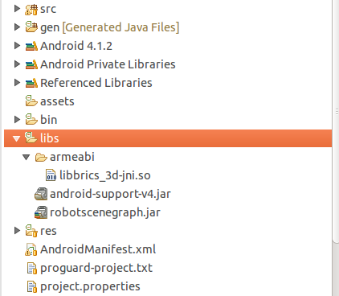
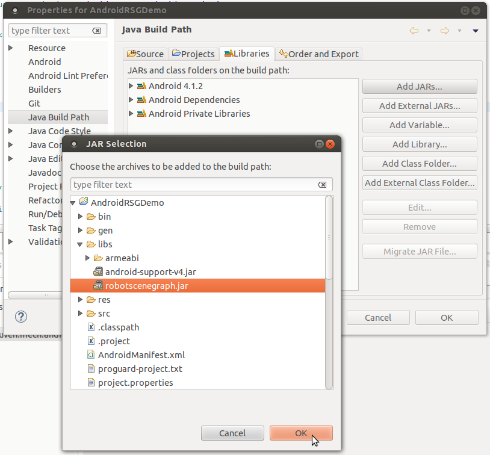
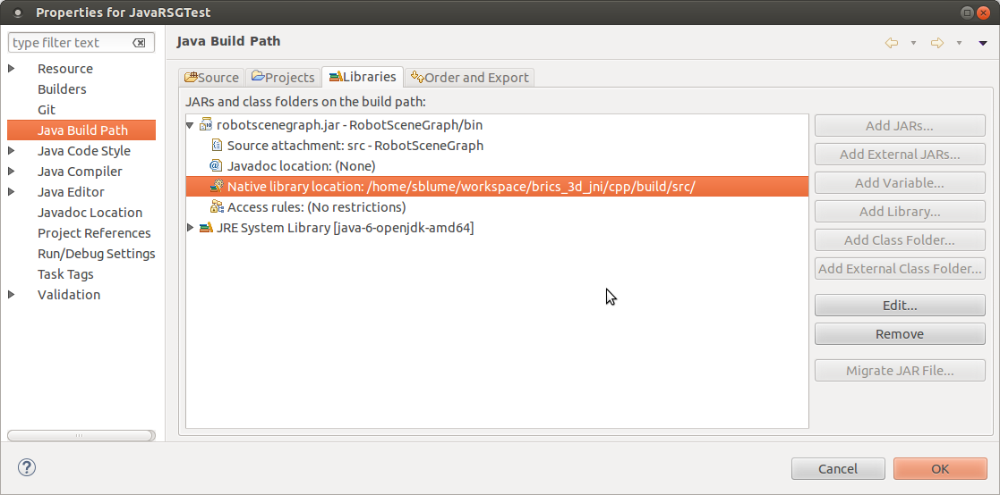

#RobotSceneGraph: The Java part

What is it?
-----------
 
This project represents the Java part of the wrapper. It is a set of of Java 
classes for basic querying and modification of the RSG. Currently it wraps the 
["High-level API"](http://www.best-of-robotics.org/brics_3d/worldmodel.html#worldmodel_secene_objects_api ) 
which essentially reduces the usage of the world model to so called *SceneObjects*. 
Calls to a particular Java instances are forwarded to the corresponding C++ 
instances via the RsgJNI native interface.

Installation
------------

The RobotSceneGraph project has been created with the Eclipse based Android SDK
(ADT Plugin). It has to be imported as an existing project. It will create a jar
file called `robotscenegraph.jar`. 


Usage within Android applications 
---------------------------------

Create a new Android project and import the C++ and Java libraries as follows:

1. Under `libs` create a new folder called `armeabi`.
2. Copy the `brics_3d-jni.so` to this folder.
3. Copy `robotscenegraph.jar` to the libs follder as well. 

   	
4. Reference to the libray in the project settings: Properties -> Java Build Path -> Librariay -> Add JARS...

   
5. Use the RSG by importing the library in the source code: 

```java
	import be.kuleuven.mech.rsg.*;
	import be.kuleuven.mech.rsg.jni.RsgJNI;
```

Usage within Java applications 
---------------------------------

Create a new Java project and import the C++ and Java libraries as follows:

1. Reference to the libray robotscenegraph.jar in the project settings: Properties -> Java Build Path -> Librariay -> Add JARS...
   Note: for a Java project it is not necessary to copy the the libraries to the new project.
   	

2. Reference to the native library by attaching it to the in the project settings: Properties -> Java Build Path -> robotscenegraph.jar -> Native library

   
3. Use the RSG by importing the library in the source code: 


```java
	import be.kuleuven.mech.rsg.*;
	import be.kuleuven.mech.rsg.jni.RsgJNI;
```

4. Disable the the Android logger by using:

```java
	Logger.setUseAndroidLogger(false); 

```
Example snippet
---------------


```java

	/* Initialize RSG */
	Rsg.initializeWorldModel(); // always start with that one.
	
	/* Create a new "SceneObejct"  */	
	SceneObject obstacle = new SceneObject();
	
	Sphere obstacleShape = new Sphere(0.35); //[m] 
	obstacle.addSphere(obstacleShape);	
	
	obstaclePose = new HomogeneousMatrix44(
		1, 0, 0, // rotation  
		0, 1, 0, 
		0, 0, 1,
		2.1, 1.5, 0); // translation	
	obstacle.addTransform(obstaclePose);
	
	ArrayList<Attribute> attributes = new ArrayList<Attribute>();
	attributes.add(new Attribute("name", "obstacle"));
	obstacle.addAttributes(attributes);

	/* Add SceneObject to RSG */
	Id obstacleId = Rsg.addSceneObject(obstacle);  
			
```

 Further examples can be found in the [examples](../examples/README.md) section.
